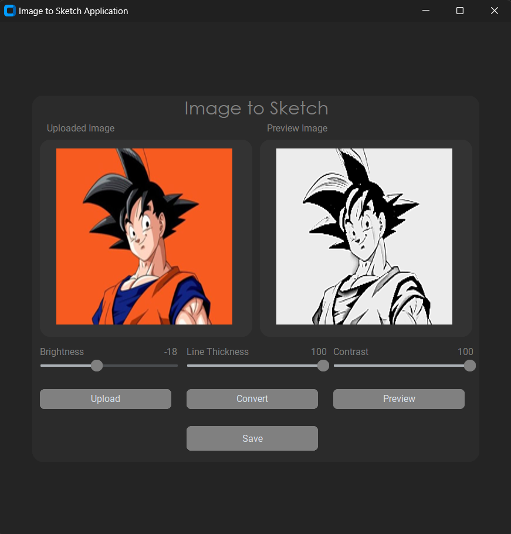

# Image to Sketch Converter

This is a simple Python application built using CustomTkinter that allows users to upload an image and convert it into a sketch. Users can also adjust parameters such as brightness, line thickness, and contrast for the sketch conversion.




## Features

### Image Upload
- Supports uploading image files in formats such as `.png`, `.jpg`, and `.jpeg`.
- Users can select an image from their local file system using the "Upload" button.

### Sketch Conversion
- Upon uploading an image, users can convert it into a sketch by clicking the "Convert" button.
- The conversion process applies various image processing techniques to create a sketch-like effect.

### Parameter Adjustment
- Users have control over three parameters to customize the appearance of the sketch:
  - **Brightness:** Adjusts the overall brightness level of the sketch.
  - **Line Thickness:** Modifies the thickness of lines in the sketch.
  - **Contrast:** Alters the contrast of the sketch, enhancing or reducing the difference between light and dark areas.

### Preview
- The application provides a preview area where users can view the converted sketch before saving or further processing.
- The preview is updated in real-time as users adjust the parameters.

### Output Image
- After converting an image into a sketch, the application displays the resulting sketch in the preview area.
- Users can save the output sketch image to their local file system for further use or sharing.

## Usage

1. **Run the Application:**
   - Execute the application script (`app.py`).
   - ```bash
     python app.py
     ```

2. **Upload Image:**
   - Click the "Upload" button to select an image file from your local file system.

3. **Adjust Parameters:**
   - Use the sliders to adjust the brightness, line thickness, and contrast according to your preference.

4. **Convert to Sketch:**
   - After uploading an image and adjusting parameters, click the "Convert" button to generate the sketch.

5. **Preview Sketch:**
   - The converted sketch will be displayed in the preview area.
   - You can continue adjusting parameters and clicking "Convert" to see different variations of the sketch.

6. **Save Output Image:**
   - Once satisfied with the sketch, click the "Save" button to save the output sketch image to your local file system.
